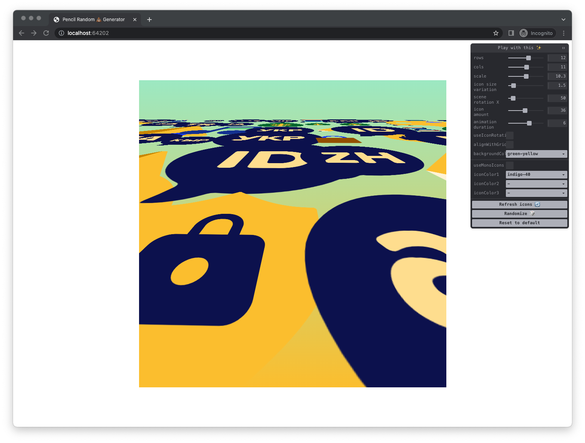

# Pencil Pattern Generator
<!-- ALL-CONTRIBUTORS-BADGE:START - Do not remove or modify this section -->
[](#contributors-)
<!-- ALL-CONTRIBUTORS-BADGE:END -->

> Pencil Random 💩 Generator was a several-hour cretive hackathon project organized by the pencil team. it resulted in an amazing css pattern generator that uses pencil branding images to create crazy effects that you can use as social media backgrounds.



## Live

[Visit live version](https://brainly.github.io/pencil-pattern-generator/)

## Local development

### Install dependencies

```bash
npm install
```

### Start development server

```bash
npm run dev
```

All files are served from the `public` folder. There is no compilation stage, the project uses the web platform as the most perfect one. All you need to do is edit files in public folder and you're done.

## Deployement

Public website is automatically published after merge to master.

## Contributors ✨

<!-- ALL-CONTRIBUTORS-LIST:START - Do not remove or modify this section -->
<!-- prettier-ignore-start -->
<!-- markdownlint-disable -->
<table>
  <tr>
    <td align="center"><a href="https://github.com/domidomi"><br /><sub><b>Dominika Podgórska</b></sub></a><br /><a href="https://github.com/brainly/pencil-pattern-generator/commits?author=domidomi" title="Code">💻</a></td>
    <td align="center"><a href="https://github.com/katarzynatobis"><br /><sub><b>katarzynatobis</b></sub></a><br /><a href="https://github.com/brainly/pencil-pattern-generator/commits?author=katarzynatobis" title="Code">💻</a> <a href="#design-katarzynatobis" title="Design">🎨</a></td>
  </tr>
</table>

<!-- markdownlint-restore -->
<!-- prettier-ignore-end -->

<!-- ALL-CONTRIBUTORS-LIST:END -->